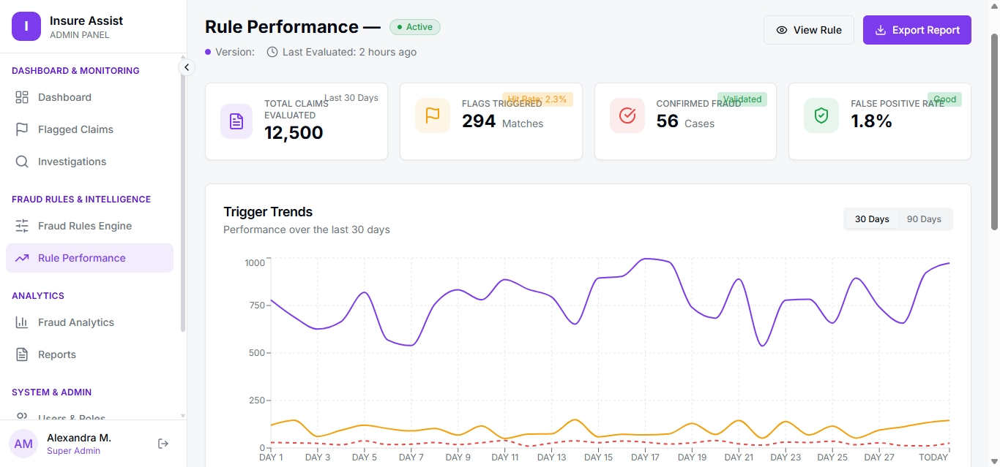

# Fraud Rules Engine – Frontend Demo

A modern web app to design, test, and monitor fraud detection rules. This project showcases an intuitive interface for rule creation, versioning, and performance exploration.

This project was built under the Infosys Springboard Internship.

Live Demo
- https://frolicking-crepe-d00cf4.netlify.app

Repository
- https://github.com/Daksh200/Infoyses-Final-Intenship-Project-Deployment

Screen Recording 
<video width="320" height="240" controls>
  <source src="demo video.mp4" type="video/mp4">
  <!-- Fallback text for browsers that do not support the video tag -->
  Your browser does not support the video tag.
</video>

Features
- Create, edit, draft, clone, and publish rules
- Toggle active/inactive status
- Versioning with notes
- Performance dashboards and triggered claims views
- Audit log with CSV export

Tech Stack
- Vite, React, TypeScript
- TailwindCSS
- Shadcn UI, Lucide Icons

Quick Start
Prerequisites: Node.js LTS

Run locally:
- cd client
- npm install
- npm run dev
- Open the printed URL (usually http://localhost:5173)

Build:
- cd client
- npm run build
- Output is in client/dist

Deploy (Free)
- Deployed on Netlify at https://frolicking-crepe-d00cf4.netlify.app
- Netlify settings:
  - Base directory: client
  - Build command: npm run build
  - Publish directory: dist

Project Structure (Brief)
- client/
  - src/pages – application pages
  - src/components – UI and feature components
  - src/api – frontend API layer
  - src/data – initial data and options
  - public/ – static assets (put banner and screenshots here)
- server/ – included for completeness

Acknowledgments
- Built under the Infosys Springboard Internship.
- UI built with Shadcn UI components and TailwindCSS.
- Icons by Lucide.

